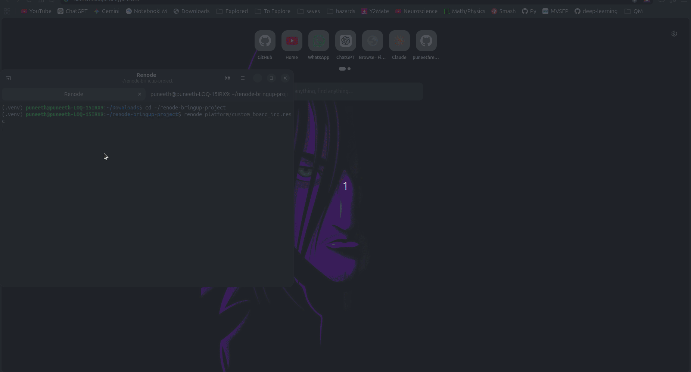

# Renode Custom Peripheral Bring-up (Zephyr RTOS)

Simulated SoC bring-up project: modeling a custom memory-mapped peripheral in Renode,
writing its device tree binding, and implementing a Zephyr RTOS driver from scratch —
covering boot, interrupt handling, and fault recovery, without physical hardware.

## Demo

Each cycle: Zephyr boots → custom peripheral driver initializes → interrupt fires and is handled by the ISR → watchdog is fed a few times → watchdog is deliberately starved → clean reset → reboot, looping indefinitely.

## Environment
- Renode v1.17.0
- Zephyr v4.4.0 (west-managed workspace)
- Target platform: `stm32h7_renode_reference_board` (Antmicro reference board, Cortex-M7)

## Status
- [x] Renode installed and verified (v1.17.0)
- [x] Zephyr `hello_world` sample built and booted inside Renode
- [x] Custom peripheral modeled in Renode (.repl) — register-verified in isolation
- [x] Zephyr driver + device tree binding written — verified end-to-end boot log
- [x] Interrupt handling verified end-to-end — Zephyr ISR confirmed via boot log
- [x] Watchdog / low-power integration — verified clean reset/reboot cycle looping indefinitely

## Setup (for reproducing)
See `docs/setup.md`
